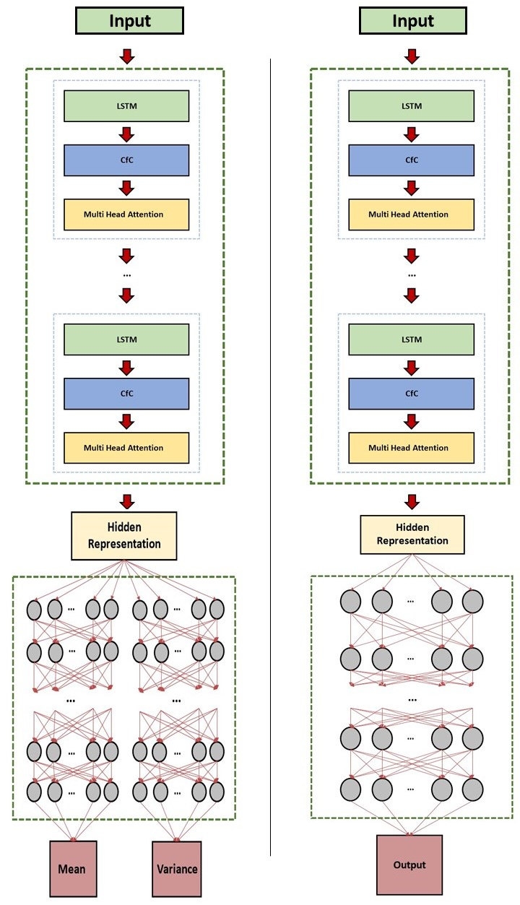

# CfC for Material Science

In this repository it's presented the research I've done at [MIT](https://www.mit.edu/) in collaboration with [Università la Sapienza di Roma](https://www.uniroma1.it/en/pagina-strutturale/home) and [ENI S.p.a](https://www.eni.com/en-IT/home.html).

In this work is explored the possibility to use a [black box](https://towardsdatascience.com/why-we-will-never-open-deep-learnings-black-box-4c27cd335118) approach to make accurate previsions on material properties, after having trained the models on some materials datasets. 
In this current scenario the coding is entirely done in [Python](https://www.python.org/), using the [Pytorch](https://pytorch.org/) library. 

The approach used to obtain those results is based on the architecture [AutoEncoder](https://www.jeremyjordan.me/autoencoders/), where a first block, called **Encoder** processes the input datas and project them in a **Rn** *latent sub-space* and the **Decoder** processes the latent information to output predictions. 

In my work the **Encoder** is composed by a series of layer of [LSTM](https://www.bioinf.jku.at/publications/older/2604.pdf)+[CfC](https://www.nature.com/articles/s42256-022-00556-7)+[Multi Head Attention](https://arxiv.org/abs/1706.03762); the **Decoder** is a [Fully Connected Network](https://deeplearningmath.org/general-fully-connected-neural-networks.html).

To provide an **Uncertainty** handling in case of noisy or multiple entries for the same inputs, the model can also use a [Variational
Approach](https://towardsdatascience.com/understanding-variational-autoencoders-vaes-f70510919f73) to calcolate the **Mean** and the **Variance** of the Output.\
In this case the **Decoder** is composed by 2 parallel Fully Connected Network
with the same structure that output simultaniously **Mean** and **Variance**.

## Index

+ [Graphical Representation of the Network](#Graphical-Representation-of-the-Network)
+ [Installation](#Installation)
+ [Usage](#Usage)
+ [Implementation of a Custom Dataset](#Implementation-of-a-Custom-Dataset)
+ [Hyperparameters Tuning and Meaning](#Hyperparameters-Tuning-and-Meaning)
+ [Visualizing Results](#Visualizing-Results)
+ [Contributing](#Contributing)
+ [License](#License)


## Graphical Representation of the Network

The Main Structure of the Network is shown below.

Those Two are the Simplified Diagrams of the Network in [Auto-Encoder](https://www.jeremyjordan.me/autoencoders/) approach and [Variational Auto-Encoder](https://towardsdatascience.com/understanding-variational-autoencoders-vaes-f70510919f73) approach respectively


Focusing on the Encoder part, it can be seen clearly as composed by **N repetitive blocks** connected in series.\
Each block is composed by a [LSTM](https://pytorch.org/docs/stable/generated/torch.nn.LSTM.html) Layer, a [CfC](https://www.nature.com/articles/s42256-022-00556-7) Layer wired with [NCP](https://publik.tuwien.ac.at/files/publik_292280.pdf) policy and a Self-Attention mechanism realised using a [Multi-Head Attention](https://arxiv.org/abs/1706.03762v5) Layer. Each sub-block is connected in series with the previous one.\
In this study each CfC block is wired using the same NCP configuration, but it could be reached further data compression reducing the **Total Number of Neurons** or increasing the **Connection Sparsity** at each sub-block subsequential connection.


As for the Encoder section, the first structure the data encounters is a [LSTM](https://pytorch.org/docs/stable/generated/torch.nn.LSTM.html) Layer, a more complex version of a standard [Recurrent Neural Network](https://www.simplilearn.com/tutorials/deep-learning-tutorial/rnn)\
This type of RNN has two different internal states:

+ **Hidden** (*h*)
+ **Memory** (*c*)

Those states can change value using a gating mechanism shown in the image below. The simultaneus presence of both *hidden* and *cell* state allows both long term and short term memory regarding the input datas. \
This gives this particular architecture, the ability to better *mine* the structure of the data, working particularly well when a perioicity of some kind is present.\
A downside of this architecture is that, having more variables, is harder to train, for this sometimes is preferred the [GRU](https://towardsdatascience.com/understanding-gru-networks-2ef37df6c9be) structure. In this work LSTM convergence was not a problem, so a GRU implementation wasn't needed nor explored.


After the [LSTM](https://pytorch.org/docs/stable/generated/torch.nn.LSTM.html) Layer is present a [CfC](https://www.nature.com/articles/s42256-022-00556-7) block. This particular structure is shown below, but it can be imagined as a RNN with time handling. 


The CfCs used in this work are a particular approximation of the Liquid Time Constant ([LTC](https://arxiv.org/abs/2006.04439)), essentially they allow a better continuous transition between hidden states using time data.\
Normally in a standard RNN such as GRU or LSTM the hidden states are passed from the state *i* to the *i+1* without considering the effective **distance** between the entry points.\
This isn't a problem in most datasets, because entries are equally spaced between each other, but in case of some unevennes in the data, the accuracy of the predictions quickly deteriorates. \
Some attemps have been made using a [RNN with a time depending decay](https://www.nature.com/articles/s41598-018-24271-9), but generally the issue wasn't solved.\
A more complete answer to the problem was given using a [Neural ODE Network](https://arxiv.org/abs/1806.07366). This kind of network could better model the changing between hidden states. The price to pay in this architecture was the increased complexity and a generally longer runtime and this significantly reduced its applications.\
CfC networks on the other hand, are lightweight computational-wise and are more robust to great unevennes in data and are, generally, capable of a better overall convergence and accuracy even in an equally spaced scenario when compared to LSTM and GRU.

The CfC Networks in this study have been wired not using a Fully-Connected Approach, but using the [NCP](https://publik.tuwien.ac.at/files/publik_292280.pdf) policy to ensure sparsness and faster computation.\
A great advantage of this kind of connection is the possibility to cut the synapses between neurons without weighting on the Optimizer. Having a wider structure but with fewer parameters to optimize, allows the network to efficiently learn complex structures in the dataset.\
In the image below is shown the discussed wiring between CfC layers


 
To complete the Encoder Layer, after a CfC block it is present a Self Attention Mechanism. This block receive as inputs all the *hidden states* retrieved during the CfC pass and it weights them to extract the most important features from the sequence.\
Even if it is simple, this structure significantly improved the accuracy of the network.


Lastly after the Encoder Layers, the *compressed information* is decoded using a Fully Connected Network. In case of noisy input data or some kind of redundace or variance in the data entries, a Variational Approach it has been developed using *Two Parallel* Fully Connected Network to output both **Mean** and **Variance** of the Prediction.


A complete image of the Network is shown below




## Installation

Once downloaded, extract the folder on your local machine and use the package manager [pip](https://pip.pypa.io/en/stable/) to install the required packages

```bash
$ pip install -r requirements.txt

```
In this current version the model libraries are portable, so no further actions are necessary.

## Usage
This is a **quick guide** to run the script, further details are in the sections below this one.

To **run** the program as it is, use:

```bash
$ python run.py
```
In this case it will run for *500 epochs* on *CPU* using as dataset **AISI 316L**.

To **run** it for a user **specified number of epochs**, use:

```bash
$ python run.py -epochs NUM_EPOCHS
```
To **speed up** the training process using the parallelization offered by **GPU** thanks to *CUDA*, use:

```bash
$ python run.py --cuda
```
To apply a **Variational approach**, obtaining as output both **Mean** and **Variance** of the Prediction, use:
```bash
$ python run.py --var
```

To train on **different dataset**, use:
```bash
$ python run.py -dataset DATASET_NAME
```
The **Datasets** cleaned and ready to use are:

1. [AISI](https://www.sciencedirect.com/science/article/abs/pii/S0890695506001507?via%3Dihub) A Dataset composed by 48 **Strain-Stress curves** at different *Temperatures* and *Strain Rates*. They are generated using Johnson and Cook Law for the Plastic Behaviour and Hooke's Law for the Elastic Behaviour of **AISI 316L Steel**.

2. [AL_COMP](https://www.sciencedirect.com/science/article/pii/S2352340919304391?via%3Dihub) A Dataset of **Al-6061** **Strain Stress curves** at different *Temperatures* and *Strain Rates*. Each sample has is own composition and that is used too in the model to made better predictions.

3. [AL_AGED](https://materialsdata.nist.gov/handle/11256/774) A Dataset of **Al-6061** **Strain Stress curves** taken under different *Aging Temperatures* and *Angles* (during the forging of the samples, they have been rolled, so this has caused some **anysotropy** in the sample. This **anysotropy** is assumed to be *absent* in the Aged Samples thanks to the reheating process).

4. [INCONEL](https://data.nist.gov/od/id/mds2-2588) A Dataset composed by several **Laser Printed Inconel** real **Stress-Strain curves** taken, at different *Angles* due to the **anysotropy** of the printed samples. If you choose this dataset you may opting also for the *--var* option, because in this particular dataset, the inputs have **high variance**, so an error handling can give both better accuracy and better results *interpretability*.

5. [STEEL](https://www.mdpi.com/2075-4701/9/3/290) A Dataset composed by several **Steel-Spring grade Strain-Stress curves**, taken under different *Temperatures* and *Strain Rates*. This particular dataset has few entry and the *inputs* are **very noisy**. Convergence is not great, but *--var* helps to have better results.


To **see** all the parameters accepted, use:
```bash
$ python run.py --help
```


## Implementation of a Custom Dataset

In the case you want to use the provided script to train the model on your personal dataset here it is a detailed guide on how to do it:
1. Locate the custom folder present in dataset  **dataset/custom**
2. In this folder create 2 folders named **numpy** and **scaler**
3. In the **scaler** folder there should be 2 files named **in_scaler.gz** and **out_scaler.gz**. This 2 files contains the scaling informations of the inputs and outputs. 
I suggest you to use my *custom library* to realize this quickly. A easy python implementation could be:

   ```python
   from core.utils import CustomScale 
   import joblib

   in_scaler = CustomScale("positive")
   scaled_tensor = in_scaler.fit_transform(unscaled_tensor)
   joblib.dump(in_scaler, scaler_folder_path + "in_scaler.gz")

   ```
   Be aware that the *fit_transform* method takes a numpy array with NxM shape. The array should be arranged to have the various input entries on the rows. Same thing can be done for the **out scaler**.

4. In the numpy folder there should be **test_dt.npy**, **test_y.npy**, **test_x.npy**, **train_dt.npy**, **train_y.npy**, **train_x.npy**, **dataset_specs.json**. To create the npy array you can use my *custom library*. A easy python implementation could be:

    ```python
    from core.utils import SlidingWindowLoader
    import numpy as np

    sliding_x_container = SlidingWindowLoader(X,window = window,padding = padding,cpu = True)
    X_sequence = sliding_x_container.out_numpy()
    np.save(X_sequence, path_numpy_folder+ "train_x.npy")

    # X -> NxM numpy array containing for example your train input datas. 
    #
    # window -> lenght of the window you want to use in the model (CfC is 
    # based on RNN, 
    # so a moving window approach is REQUIRED)
    #
    # padding -> allows zero-padding at the beginning of the sequence. 
    # It is suitable for datas that begins with zero (for example Strain- 
    # Stress curves), 
    # but for others such as Weather Data it is not, so in this case it 
    # should be set as False.
    #
    # cpu -> set True, if False it puts the tensors on GPU, but it is an old 
    # implementation.

    ```


    Mind that CfC models uses also time in the form of timespans (*Ti - Ti-1*),
so to generate the sequence in case of *zero padding* you have to be cautious. 
In the research it was used this method and it gave good results:

    ```python
    from core.utils import adjust_time
    T = np.vstack((np.arange(0,window)[:,np.newaxis],T- T.min()+window))
    dT = adjust_time(T)
    sliding_dT_container = SlidingWindowLoader(dT,window = window,padding = False,cpu = True)
    dT_sequence = sliding_dT_container.out_numpy()
    np.save(dT_sequence, path_numpy_folder + "train_dt.npy")

    # T -> your train time vector Nx1 (T1,T2,T3,...,Tn)

    ```

   So essentially the Time vector was expanded inserting a sequence of T entries spaced by one, moving every other entry by a *window* value.

   *adjust_time* is just a function that performs Ti - Ti-1 on every couple of elements in the array to generate a dT tensor. 

   With this *trick* for the *zero-padded* part of the inputs the dT tensor it will be a sequence of 1, after the zero padding the dT and inputs will be untouched. \
 This *trick* allows you to use the first T sequence of input data that would be, otherwise, lost.\
If padding is False in the input sequence generation, the time trick doesn't need to be performed.

   In the case of **multiple curves** (like in every datasets used in this research). Assuming you have N curves containing the train data in some .cvs files.

    ```python
    import os
    from os.path import join, isfile, listdir
    raw_in_list_train = []
    raw_out_list_train = []
    dt_list_train = []
    curves_files = [f for f in listdir(path_train_curves) if isfile(join(path_train_curves, f))]
    for curve in curves_files:
        raw = pd.read_csv(path_train_curves + curve)

        time = #your way to extract time data (mind it should be a column vector)
        time = np.vstack((np.arange(0,window)[:,np.newaxis],time-time.min()+window))
        d_time = adjust_time(time)
        dt_container = SlidingWindowLoader(d_time,window = lookback,padding = False,cpu = True)
        dt = dt_container.out_numpy()

        raw_in_temp = #your way to extract input data (mind it should be a column vector)
        raw_out_temp = #your way to extract output data (mind it should be a column vector)
        raw_in_temp = in_scaler.fit_transform(raw_in_temp)   
        # normalization it helps a faster and better convergence
        raw_out_temp = out_scaler.fit_transform(raw_out_temp)
        # normalization it helps a faster and better convergence
        raw_in_container = SlidingWindowLoader(raw_in_temp,window = lookback,padding = True,cpu = True)
        raw_in = raw_in_container.out_numpy()
        raw_out = raw_out_temp

        raw_in_list_test.append(raw_in)
        raw_out_list_test.append(raw_out)
        dt_list_test.append(dt)

    x_train = np.concatenate(raw_in_list_train,axis = 0)
    y_train = np.concatenate(raw_out_list_train,axis = 0)
    dt_train = np.concatenate(dt_list_train,axis = 0)
    np.save(path_numpy_folder + "train_x.npy", x_train)
    np.save(path_numpy_folder + "train_y.npy", y_train)
    np.save(path_numpy_folder + "train_dt.npy", dt_train)
    ```
5. Lastly in the numpy folder you need to create the *dataset_specs.json*, this would be used in the results plotting. It is a file with a very simple dictionary structure.\
Let's dive in in every **key-value** pair:

    - *train_curves* : This is the number of train curves you used as int

    - *test_curves* : This is the number of test curves you used as int

    - *input_names*: It should be a list of string in the format "Name Entry"+ " " + "(Measure unit used without spacing)"

    - *output_names*: It should be a list of string in the format "Name Entry"+ " " + "(Measure unit used without spacing)"

    - *title*: It should be a string containing the Name you want displayed as a title on the plot

   Here there is an example:
   ```json
   {
    "train_curves": 100,
    "test_curves": 4,
    "valid_curves": 33,
    "input_names": [
        "Strain (%)",
        "Temp (\u00b0C)",
        "LogSR (s-1)"
    ],
    "output_names": [
        "Stress (MPa)"
    ],
    "title": "AISI 316L"
   }

   ```
   In this case the Dataset is [AISI](https://www.sciencedirect.com/science/article/abs/pii/S0890695506001507?via%3Dihub), the input data are: *Strain*, *Temp* and *LogSR* and their Measure Units are *%*, *°C* and *s-1* respectively, meanwhile the output data is *Stress* and its Measure Unit is *MPa*


6. Once you have created the dataset inside the custom folder, you can run the script, use:
   ```sh
   $ python run.py -dataset CUSTOM

   ```
## Hyperparameters Tuning and Meaning

To manually change the hyperparameters you need to modify the *config_model.json* located in the main folder. \
Essentially the config file has 3 sections: *Encoder*, *Decoder*, *Training*. \
 Here it is a guide that explain what each entry does:

1. **Encoder**

   + *total_neurons*: Number of **Total Neurons** on the [**CfC**](https://www.nature.com/articles/s42256-022-00556-7) and [**LSTM**](https://pytorch.org/docs/stable/generated/torch.nn.LSTM.html) layers, it can be virtually any number. \
Do not set a too large value, because the memory needed will increase rapidly and it will slow down the training process making the convergence harder. \
[CfC](https://www.nature.com/articles/s42256-022-00556-7) are **very efficient** so it is really not needed a very wide network. \
So **25**,**30**,**35** are good values and it can give a very good performance on a lot of scenarios.

    + *motor_neurons*: Number of **Final Neurons** of the [**CfC Layer**](https://www.nature.com/articles/s42256-022-00556-7). \
Data compression is **good** in the Neural Network applications. A very high number it may capture more features but it can slow down the training, on the other hand a low value it may be not sufficient to capture all the features and the accuracy it will be low. \
**Compromise** here is the **key** to obtain good results.\
 Mind also that *motor_neurons* are included in the *total_neurons* value, so a good rule of thumb it should be **motor_neurons < total_neurons/3**

   + *sparsity*: This is the **main feature** of [**CfC**](https://www.nature.com/articles/s42256-022-00556-7) with [**NCP**](https://publik.tuwien.ac.at/files/publik_292280.pdf) policy, read the [original paper](https://publik.tuwien.ac.at/files/publik_292280.pdf) to understand a little more about it. Allowed value are in the range **0-1**, a low value it means the network is pratically fully connected, a highy value it means the network has some not connected neurons(and it is here that the magic happens). \
**A good starting value could be 0.5**.

   + *n_layers_cfc*: This is the number of **LSTM-CfC-Multi Head Attention** layers present in the Encoder part. \
**One** is good enought in most application, if you increase the layers the network it will became more complex, but training will be both slower and harder.

   + *key_size*, *query_size*, *value_size*: They **HAVE** to be equal to *motor_neurons* value.

   + *heads*: It is the number of **Heads** the [**Multi Head Attention Module**](https://arxiv.org/abs/1706.03762v5) should have. Read the [original paper](https://arxiv.org/abs/1706.03762v5) for more details.\
This number it needs to be a divisor of *motor_neurons* in order to work.

   + *dropout*: It is the dropout probability, read the [documentation](https://pytorch.org/docs/stable/generated/torch.nn.Dropout.html) on Pytorch website for more informations. \
Allowed values are in **0-1** range, with **lower value** no dropout will happen and little counter-overfitting will happen, with **high value** this fenomenom will increase in frequency, but the training will be harder.

   + *symmetric*: **LEAVE ALWAYS TRUE**

2. **Decoder**

   + *layers_fcn*: Layers of [**Fully Connected Network**](https://pytorch.org/docs/stable/generated/torch.nn.Linear.html) in the **Decoder** part.\
Allowed values starts from 2, but as a rule of thumb a good starting point is **5** or **6**.

   + *width_fcn*: Width of [**Fully Connected Network**](https://pytorch.org/docs/stable/generated/torch.nn.Linear.html) in the **Decoder** part.\
Allowed values starts from 1 (trivial case), but as a rule of thumb a good starting point is **16** or **32**.

   + *decay_fcn*: This control the change in width of the [**FCN**](https://pytorch.org/docs/stable/generated/torch.nn.Linear.html) for every layer.\
For example having a decay set to **2** and starting with a **64** *width* the progression will be: \
**64 -> 32 -> 16 -> 8 -> 4** ... \
It is useful because it **compresses** information in the **Decoder** part.\
Be sure the decay and the number of layers are compatible with the starting width of the [**FCN**](https://pytorch.org/docs/stable/generated/torch.nn.Linear.html) network.

   + *norm*: It is a *flag* that control the presence or not of a [**Normalization Layer**](https://pytorch.org/docs/stable/generated/torch.nn.LayerNorm.html) in each [**FCN**](https://pytorch.org/docs/stable/generated/torch.nn.Linear.html) layer, read the [documentation](https://pytorch.org/docs/stable/generated/torch.nn.LayerNorm.html) on Pytorch website for more informations about it. \
Allowed values are **False**, **True**. \
With *False* is **Disabled** and with *True* is **Enabled**.

   + *activation*: It specifies the [activation functions](https://pytorch.org/docs/stable/nn.html#non-linear-activations-weighted-sum-nonlinearity) on the [**FCN**](https://pytorch.org/docs/stable/generated/torch.nn.Linear.html) layers.\
Allowed values are:
      + *relu*:  [**LeakyReLU**](https://pytorch.org/docs/stable/generated/torch.nn.LeakyReLU.html#torch.nn.LeakyReLU) activation function
      + *sigmoid*: [**Sigmoid**](https://pytorch.org/docs/stable/generated/torch.nn.Sigmoid.html#torch.nn.Sigmoid) activation function
      + *hardtanh*: [**HardTanh**](https://pytorch.org/docs/stable/generated/torch.nn.Hardtanh.html#torch.nn.Hardtanh) activation function

3. **Training**

   + *lr*: It is the step the [Optimizing Function](https://pytorch.org/docs/stable/optim.html) will use to perform [Gradient Descend](https://www.ibm.com/topics/gradient-descent#:~:text=Gradient%20descent%20is%20an%20optimization,each%20iteration%20of%20parameter%20updates.) during *Training*.\
A good starting value could be **5e-3**.

   + *gamma*: It is the value controlling the [**Exponential Decay**](https://pytorch.org/docs/stable/generated/torch.optim.lr_scheduler.ExponentialLR.html) of *lr* each *epoch* during *Training*.\
It is used to speed up the training at the beginning, because it allows a greater starting *lr* value, but decreasing *lr* during each epoch it permits a better convergence overall.\
A good starting value could be **0.99**.


\
\
\
Here it follows an example of the *config_model.json* template. The same template is also present in the main project folder.

```json
{
    "config_wiring": {
        "motor_neurons": 8,
        "total_neurons": 20,
        "sparsity": 0.5,
        "n_layers_cfc": 1
    },
    "config_attn": {
        "key_size": 8,
        "query_size": 8,
        "value_size": 8,
        "heads": 2,
        "dropout": 0.0,
        "symmetric": true
    },
    "n_layers_cfc": 1,
    "motor_neurons": 8,
    "layers_fcn": 3,
    "width_fcn": 64,
    "decay_fcn": 2,
    "norm": false,
    "activation": "sigmoid",
    "lr" : 5e-3,
    "gamma" : 0.998
}

```

## Visualizing Results

Once you have executed the script the results are stored in the execution folder. \
You will notice a new folder has just been created named **results**, inside there will be a child folder with a name based on your dataset selection.\
Inside this folder there will be a folder named **normal** or **var** depending on the triggering of the **--var** option during the execution.\
Inside one of those two folder are stored the results in directory having as a name the timestamp of the script execution.

For example running at **15:30** on **02/05/23** the script with:

```bash
$ python run.py --cuda --var -dataset AISI

```
You will find the results inside **results/aisi/var/2023_05_02_15_30/**

## Contributing

For major changes, please open an issue first
to discuss what you would like to change.


## License

[Apache License](http://www.apache.org/licenses/LICENSE-2.0)

